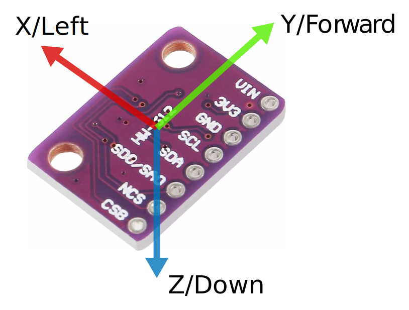

# GY-91 [ MPU9250 & BMP280 ] Sensor Integration with ESP32 via SPI

This project demonstrates how to interface an ESP32 microcontroller with GY-91 Sensor [MPU9250 (IMU sensor) and BMP280 (pressure/temperature sensor)] using SPI communication. The system provides readings for acceleration, gyroscope, temperature, pressure, and altitude.

## Hardware Requirements

- ESP32 Development Board (DOIT DevKit V1)
- GY-91 Sensor
- Jumper Wires
- Breadboard (optional)

## Wiring Connections

### SPI Pin Configuration

#### Detailed Connection Table

| ESP32 Pin | GY-91 Pin | Description    |
|-----------|---------|------------------|
| 3.3V      | 3V3     | Power Supply     |
| GND       | GND     | Ground           |
| GPIO 18   | SCL     | I2C Data Line (SPI Clock)    |
| GPIO 23   | SDA     | I2C Clock Line (MOSI Pin for SPI)   |
| GPIO 19   | SD0/SA0 | Address adjust for I2C (MISO Pin for SPI) |
| GPIO 5    | NCS     | Chip select only for MPU9250   |
| GPIO 15   | CSB     | Chip select only for BMP280   |

(GPIO 15 is not used in this project)

## IMU Orientation

The MPU9250 sensor readings are based on the following orientation:

- X axis: pointing left (L)
- Y axis: pointing forward (F)
- Z axis: pointing down (D)

## Run the code

- must have vscode installed with platformio extension
- Clone the repository
- copy contents of `.txt` files to `main.cpp` inside the `src` folder
- upload the code to the ESP32
- open the serial monitor to see the data
- select the correct port and baud rate

or alternatively,

- go to `PlatformIO home -> Open -> select project name -> Board: DOIT DevKit V1 -> Framework: Arduino`
- Download `util.h` and `vector.h` from the `include` folder

    - Move it to the `include` folder in the project

- Copy the contents of `platformio.ini` file to the project
- copy contents of `.txt` files to `main.cpp` inside the `src` folder
- upload the code to the ESP32
- open the serial monitor to see the data
- select the correct port and baud rate

### Descriptions of `.txt` files

- `test.txt`: tests the MPU9250 sensor via I2C
- `read_gyro_data.txt`: reads the gyroscope data from the MPU9250 sensor
- `calibrate_gyro.txt`: calibrates the gyroscope data from the MPU9250 sensor
- `calibrate_gyro_and_accel.txt`: calibrates the gyroscope and accelerometer data from the MPU9250 sensor
- `calibrate_flix.txt`: calibrates the MPU9250 sensor via FlixPeriph library

## References

- [flix](https://github.com/okalachev/flix)
- [flixperiph](https://github.com/okalachev/flixperiph)

